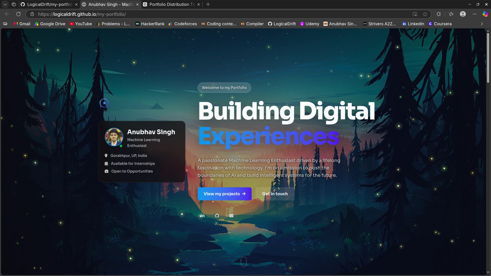

## Preview



# 🌌 Anubhav Singh | Portfolio

> A modern, interactive portfolio website showcasing my journey, skills, and projects in Machine Learning and Software Development.

<p align="center">
  <a href="https://logicaldrift.github.io/my-portfolio/">🌐 Live Demo</a>
  •
  <a href="https://github.com/LogicalDrift">GitHub</a>
  •
  <a href="https://www.linkedin.com/in/anubhavsingh2794/">LinkedIn</a>
</p>

---

## 📖 About

This portfolio represents my passion for building beautiful user experiences while pursuing Machine Learning and Artificial Intelligence.

The website is designed from scratch using vanilla HTML, CSS, and JavaScript, focusing on performance, animations, and a premium user experience without relying on heavy frameworks.

---

## ✨ Features

- 🎨 Modern dark-themed UI
- 🖱️ Custom animated cursor
- ✨ Smooth scroll animations
- 📱 Fully responsive design
- 📊 Animated skills section
- 💼 Resume download
- 📂 Dedicated project showcase
- 📬 Contact section
- ⚡ Lightweight and fast
- 🌌 Interactive hero background

---

## 🛠️ Tech Stack

| Frontend | Styling | Tools |
|----------|----------|-------|
| HTML5 | CSS3 | GitHub Pages |
| JavaScript (ES6) | Glassmorphism | Font Awesome |
| Responsive Design | CSS Animations | Google Fonts |

---

## 📂 Project Structure

```
my-portfolio/
│
├── index.html
├── styles.css
├── script.js
├── assets/
│   ├── icons/
│   ├── resume/
│   ├── images/
│   └── ...
└── README.md
```

---

## 🎯 Highlights

- Built entirely with Vanilla Web Technologies
- Optimized for desktop and mobile
- Interactive navigation with active indicators
- Dynamic skill cards
- Modern UI inspired by premium portfolios
- Smooth scrolling experience

---

## 🚀 Live Website

🌐 https://logicaldrift.github.io/my-portfolio/

---

## 📬 Contact

**Anubhav Singh**

- 📧 anubhavsingh2794@gmail.com
- 💼 LinkedIn: https://www.linkedin.com/in/anubhavsingh2794/
- 🐙 GitHub: https://github.com/LogicalDrift

---

## ⭐ Support

If you like this portfolio or found it inspiring, consider giving this repository a ⭐.
